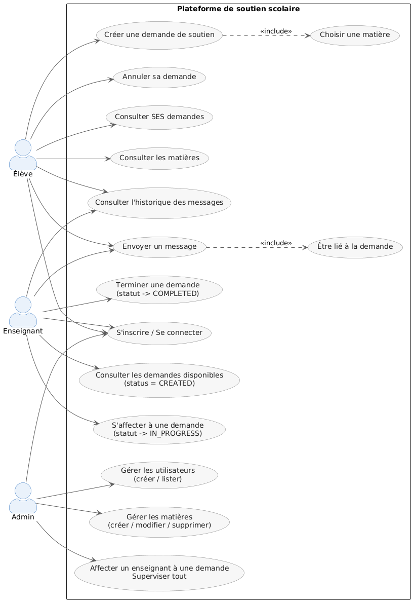
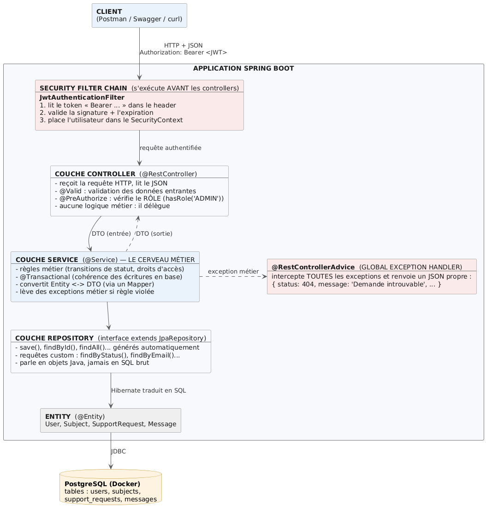
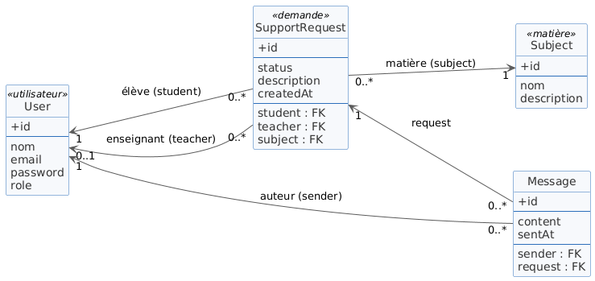
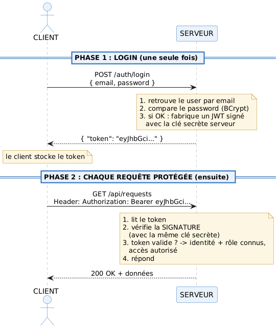
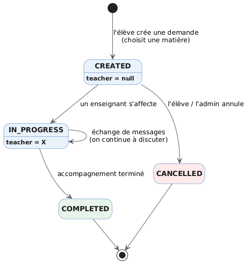
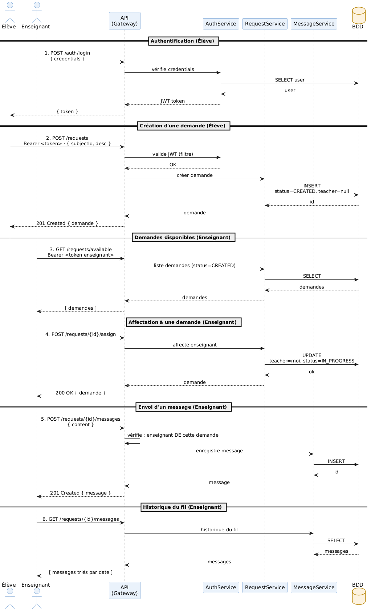

# Rendu du Test Technique Spring Boot : Plateforme de Soutien Scolaire

> Ce document est structuré selon l'ossature imposée par le sujet. Le code source, le fichier README (instructions d'installation et d'utilisation) ainsi que la suite de tests accompagnent ce rendu.

---

## 1. Compréhension du sujet

L'objectif de cet exercice est de développer une **API REST back-end** robuste et sécurisée pour une plateforme de soutien scolaire. Celle-ci orchestre la mise en relation et les échanges entre trois profils d'utilisateurs : **les élèves**, **les enseignants** et **les administrateurs**.

Les besoins fonctionnels majeurs s'articulent autour des axes suivants :
* **Gestion des utilisateurs** : Inscription, authentification et habilitations basées sur des rôles distincts.
* **Référentiel des matières** : Gestion des disciplines scolaires disponibles pour le soutien.
* **Cycle de vie des demandes** : Suivi rigoureux de l'état d'un accompagnement depuis sa création jusqu'à sa clôture (`CREATED → IN_PROGRESS → COMPLETED / CANCELLED`).
* **Messagerie contextuelle** : Intégration d'un fil de discussion unique et historique par demande, restreint aux seuls participants concernés.
* **Sécurisation applicative** : Contrôle des accès selon les rôles globaux et validation fine de la propriété des données.

### Synthèse des cas d'utilisation par rôle

* **ÉLÈVE** : Création de compte, consultation des matières, publication d'une demande de soutien, annulation ou clôture de sa propre demande, envoi et lecture des messages liés à son fil.
* **ENSEIGNANT** : Consultation des demandes en attente (`CREATED`), affectation à une demande disponible, communication par message avec l'élève sur les demandes prises en charge.
* **ADMIN** : Gestion globale du référentiel (matières, utilisateurs) et supervision en lecture de l'ensemble des demandes et historiques de la plateforme.



---

## 2. Choix techniques

| Élément | Technologie retenue | Justification métier et technique |
| :--- | :--- | :--- |
| **Langage / Framework** | Java 17 / Spring Boot 3.3.5 | Stack technologique imposée, version LTS stable, écosystème performant. |
| **Base de données** | **PostgreSQL** (via Docker) | Système de gestion de base de données relationnelle robuste. L'usage de Docker garantit la portabilité et l'exécution immédiate du projet sans configuration locale lourde. |
| **Base de tests** | **H2 Database** | Base de données en mémoire permettant d'exécuter la suite de tests de manière autonome et isolée, sans dépendance externe. |
| **Sécurité** | **Spring Security + JWT** | Choix d'une architecture d'authentification *stateless* par jetons signés, optimale et standard pour une API REST. |
| **Documentation** | **Springdoc-openapi / Swagger UI** | Génération automatique d'une documentation interactive accessible via l'URL `/swagger-ui.html`, facilitant la recette des endpoints. |
| **Mapping de données** | Mapping manuel (`fromEntity`) | Approche explicite, lisible et performante sans l'ajout de dépendances de réflexion complexes. |
| **Boilerplate** | Project Lombok | Automatisation de la génération des getters, setters, constructeurs et builders pour un code plus épuré. |
| **Conteneurisation** | Dockerfile multi-stage & Docker Compose | Industrialisation du build et de l'exécution. Le mécanisme de *healthcheck* assure que l'application attend la disponibilité complète de PostgreSQL avant de démarrer. |
| **Gestion des secrets** | Fichier `.env` (gitignoré) | Isolation stricte des données sensibles (clés de signature JWT, mots de passe). Un modèle `.env.example` est fourni pour l'installation. |

---

## 3. Architecture du projet Spring Boot

Le projet adopte une architecture **en couches (Layered Architecture)** stricte, assurant une séparation claire des responsabilités :




### Principes directeurs appliqués
* **Controllers** : En charge de l'exposition REST, de la capture des requêtes HTTP et de la validation syntaxique des données entrantes. Ils délèguent immédiatement le traitement à la couche logicielle inférieure.
* **Services** : Emplacement exclusif de la logique métier, des règles de gestion et de la démarcation transactionnelle (`@Transactional`).
* **Repositories** : Interfaces d'abstraction de données exploitant Spring Data JPA pour les opérations CRUD et les requêtes dérivées.
* **DTO (Data Transfer Objects)** : Étanchéité absolue des entités du domaine. Aucune entité JPA ne traverse la couche Controller afin d'éviter les fuites de données (ex: mots de passe) et les problèmes de récursion circulaire lors de la sérialisation JSON.
* **Gestion des exceptions** : Centralisation des anomalies via un intercepteur unique (`@RestControllerAdvice`).

### Organisation des packages


```

com.soutien
├── config/       # Configurations globales (SecurityConfig, OpenApiConfig)
├── controller/   # Contrôleurs REST (Auth, User, Subject, SupportRequest, Message)
├── service/      # Services métier et interfaces logiques
├── repository/   # Interfaces Spring Data JPA
├── entity/       # Modèles du domaine, entités persistantes et énumérations
├── dto/          # Objets de transfert de données (Request/Response) et formats d'erreur
├── exception/    # Exceptions customisées et gestionnaire global
└── security/     # Logique d'authentification (Services JWT, Filtres, Décodeurs)

```

---

## 4. Modèle de données

Le schéma relationnel repose sur quatre entités clés structurées de manière cohérente :



* **User** : Contient les informations d'authentification. Les rôles (`STUDENT`, `TEACHER`, `ADMIN`) sont stockés sous forme de chaînes de caractères (`EnumType.STRING`) en base de données pour plus de clarté.
* **Subject** : Représente le référentiel des matières (ex: "Mathématiques"). Chaque matière possède un nom unique et obligatoire.
* **SupportRequest** : Pivot central de l'application. La relation avec l'enseignant (`teacher_id`) est explicitement définie comme **nullable**. À la création, ce champ est à `null` et n'est valorisé que lors de la prise en charge effective par un professeur.
* **Message** : Matérialise les échanges. Chaque message est doublement lié à son auteur (`User`) et obligatoirement ancré à une demande de soutien (`SupportRequest`), modélisant un fil de discussion cloisonné. Les chargements relationnels (`FetchType.LAZY`) sont configurés par défaut pour optimiser les performances SQL.

---

## 5. Endpoints REST développés

### Authentification (Accès public)
* `POST /api/auth/register`:Inscription d'un nouvel utilisateur (génère un jeton JWT).
* `POST /api/auth/login`:Authentification de l'utilisateur (renvoie le jeton JWT).

### Matières Scolaires
* `GET /api/subjects`:Liste l'ensemble des matières (Accessible à tout utilisateur authentifié).
* `POST /api/subjects`:Ajout d'une nouvelle matière (**ADMIN** uniquement).
* `PUT /api/subjects/{id}`:Modification d'une matière (**ADMIN** uniquement).
* `DELETE /api/subjects/{id}`:Suppression d'une matière (**ADMIN** uniquement).

### Demandes de soutien scolaire
* `POST /api/requests`:Soumission d'une nouvelle demande (**STUDENT** uniquement).
* `GET /api/requests/available`:Visualisation des demandes en attente d'affectation (**TEACHER**, **ADMIN**).
* `GET /api/requests/mine`:Consultation de son tableau de bord personnel (Retourne les demandes spécifiques à l'élève connecté ou à l'enseignant connecté).
* `GET /api/requests/{id}`:Consultation des détails d'une demande (Réservé aux participants directs ou à l'**ADMIN**).
* `POST /api/requests/{id}/assign`:Prise en charge d'une demande par un enseignant (**TEACHER** uniquement).
* `PATCH /api/requests/{id}/complete`:Passage de la demande à l'état terminé (**STUDENT** créateur ou **ADMIN**).
* `PATCH /api/requests/{id}/cancel`:Annulation d'une demande (**STUDENT** créateur ou **ADMIN**).

### Messagerie intégrée
* `POST /api/requests/{id}/messages`:Envoi d'un message au sein d'une demande (Réservé à l'élève émetteur et à l'enseignant assigné).
* `GET /api/requests/{id}/messages`:Extraction chronologique de l'historique des échanges (Participants et **ADMIN**).

### Administration des utilisateurs
* `GET /api/users`:Liste l'ensemble des comptes de la plateforme (**ADMIN** uniquement).
* `GET /api/users/{id}`:Consultation d'un profil utilisateur spécifique (**ADMIN** uniquement).

---

## 6. Gestion des rôles et des droits

Le système applique une double barrière de contrôle de sécurité pour sanctuariser les données :

1. **Sécurité au niveau macro (Rôles globaux)** : Implémentée via l'annotation `@PreAuthorize` au niveau des points d'accès des contrôleurs (ex: `hasRole('ADMIN')` ou `hasRole('STUDENT')`).
2. **Sécurité au niveau micro (Propriété des données)** : Implémentée dynamiquement au sein de la couche Service. Posséder le rôle adéquat ne suffit pas ; le système vérifie systématiquement que l'identifiant de l'utilisateur connecté correspond à l'élève créateur ou à l'enseignant assigné avant d'autoriser la lecture ou l'écriture (ex: accès aux messages, clôture de dossier).

### Authentification Stateless via JWT
* Le mot de passe soumis à l'inscription est haché à l'aide de l'algorithme robuste **BCrypt** avant persistance.
* Lors de la connexion, un jeton JWT cryptographiquement signé est délivré au client.
* Le composant `JwtAuthenticationFilter` intercepte chaque requête entrante, valide le jeton (signature et expiration) et peuple le `SecurityContextHolder` de Spring Security. La protection CSRF est désactivée par conception, l'API n'utilisant aucun cookie de session.



### Codes de retour HTTP standardisés
* `401 Unauthorized` : Utilisateur non authentifié ou jeton altéré/expiré.
* `403 Forbidden` : Utilisateur authentifié mais disposant de privilèges insuffisants (violation de rôle ou tentative d'accès à la ressource d'un tiers).

---

## 7. Gestion des demandes de soutien scolaire

L'application intègre une machine à états stricte régissant le cycle de vie d'une demande d'accompagnement :



### Règles métier appliquées :
* **Initialisation** : Toute demande est instanciée par défaut à l'état `CREATED` sans enseignant assigné.
* **Règle d'affectation** : Un enseignant ne peut s'assigner qu'une demande dont l'état est strictement égal à `CREATED`. Si un autre enseignant a déjà validé l'affectation, une erreur `400 Bad Request` est immédiatement levée.
* **Règle de clôture (`COMPLETED`)** : Par choix de conception métier, **seul l'élève à l'origine de la demande ou un administrateur peut valider la clôture**. Un enseignant ne peut pas valider unilatéralement la fin d'un service afin d'éviter tout abus de facturation ou de déclaration de complétion sans service rendu. La clôture n'est autorisée que si la demande est active (`IN_PROGRESS`).
* **Règle d'annulation (`CANCELLED`)** : L'élève ou l'administrateur peut interrompre une demande à tout moment, sous réserve que celle-ci ne soit pas déjà classée comme `COMPLETED`.

---

## 8. Messagerie entre élève et enseignant

La communication est entièrement contextualisée autour de la demande de soutien pour garantir la clarté des échanges.

* **Condition d'activation** : Le canal de messagerie n'est ouvert que lorsque la demande bascule à l'état `IN_PROGRESS` (l'enseignant est affecté). Tant que la demande est à l'état `CREATED`, l'envoi de messages est bloqué (`400 Bad Request` : aucun interlocuteur disponible).
* **Contrôle de confidentialité** : Le service vérifie à chaque interaction que le demandeur est l'élève propriétaire ou l'enseignant en charge du dossier. Tout accès par un tiers externe se solde par une exception d'accès refusé (`403 Forbidden`).
* **Format des payloads** : L'historique renvoie pour chaque message le contenu, l'horodatage précis ainsi que le rôle de l'émetteur, facilitant le rendu visuel de la discussion côté client.



---

## 9. Gestion des erreurs et validations

### Validation des données entrantes
Les objets DTO exploitent les annotations standard de l'API `jakarta.validation` (`@NotBlank`, `@Email`, `@NotNull`, `@Size`). L'usage de l'annotation `@Valid` sur les contrôleurs intercepte les requêtes malformées et lève une exception `MethodArgumentNotValidException`, automatiquement convertie en réponse HTTP `400` contenant une cartographie claire des anomalies champ par champ.

### Intercepteur Global des Exceptions
Le composant `GlobalExceptionHandler` unifie la structure des réponses d'erreur sous un format JSON standardisé (`ApiError`) :

| Type d'exception | Code HTTP | Cas d'usage type |
| :--- | :--- | :--- |
| `ResourceNotFoundException` | **404 Not Found** | Identifiant de matière, de demande ou d'utilisateur inexistant. |
| `BusinessException` | **400 Bad Request** | Violation d'une règle métier (ex: transition d'état interdite, enseignant déjà affecté). |
| `AccessDeniedException` | **403 Forbidden** | Droits insuffisants ou tentative de lecture/écriture sur les données d'un tiers. |
| `MethodArgumentNotValidException` | **400 Bad Request** | Données d'entrée invalides (ex: format d'email incorrect, champ obligatoire vide). |
| `Exception` | **500 Internal Error** | Filet de sécurité pour intercepter et journaliser proprement les erreurs système imprévues. |

---

## 10. Tests réalisés

La validation de la qualité et de la conformité du code s'appuie sur une suite automatisée de **12 tests**, tous validés avec succès (`SUCCES / 100% OK`).

### 1. Tests Unitaires (`SupportRequestServiceTest`)
Mise en œuvre via **JUnit 5** et **Mockito** pour isoler la logique métier en simulant le comportement des dépôts de données :
* Validation de la transition initiale à l'état `CREATED`.
* Scénarios d'affectations nominales et mise en échec en cas de conflit d'enseignants.
* Vérification des règles de permissions lors des demandes de clôture (`COMPLETED`) et d'annulation (`CANCELLED`).

### 2. Tests d'Intégration Globaux (`ApplicationIntegrationTest`)
Exécution sur une base de données **H2 en mémoire** simulant un cas d'usage de bout en bout via **MockMvc** :
* Enchaînement complet : Inscription de profils (`STUDENT`, `TEACHER`) → Authentification et extraction des JWT → Création d'une matière → Soumission d'une demande → Affectation du professeur → Échanges de messages de messagerie → Extraction de l'historique → Clôture finale de l'accompagnement.
* Validation du comportement de la sécurité : Rejet des requêtes anonymes (`401`) et blocage des élévations de privilèges (`403`).

---

## 11. Documentation d'installation et d'utilisation

Un guide technique exhaustif est consigné dans le fichier `README.md` à la racine du livrable. Il détaille notamment :
* **Prérequis système** : Java 17+, Maven 3.8+ et Docker installés.
* **Gestion de l'environnement** : Copie et configuration du fichier `.env` à partir du modèle `.env.example`.
* **Modes de déploiement** :
  1. *Déploiement conteneurisé complet* : `docker compose up --build` instancie et interconnecte l'API et la base PostgreSQL automatiquement.
  2. *Déploiement hybride* : Exécution locale de l'application via `mvn spring-boot:run` connectée au conteneur de données PostgreSQL isolé.
* **Outils de test** : Fichier `requests.http` intégré pour exécuter et tester le scénario complet en un clic directement depuis l'environnement de développement (IDE), accompagné d'exemples de commandes `curl`.

---

## 12. Difficultés rencontrées

* **Le dilemme du comportement 401 vs 403 sous `@PreAuthorize`** : Lors des phases de test de sécurité, un utilisateur authentifié mais aux droits restreints déclenchait un code `401 Unauthorized` au lieu du code `403 Forbidden` attendu. Une analyse fine de la chaîne via les logs d'exécution `TRACE` de Spring Security a révélé que le rejet initial de droits (403) forçait une redirection interne du framework vers la route par défaut `/error`. Le filtre JWT (`OncePerRequestFilter`), ignorant par défaut les sous-requêtes de type erreur, réévaluait l'accès comme anonyme, écrasant le statut par un 401. Ce comportement a été corrigé en ouvrant l'accès public à la route `/error` et en raccordant un `AccessDeniedHandler` personnalisé écrivant la réponse HTTP adéquate à la source.
* **Granularité de la couche Sécurité** : Découpler la logique de restriction globale basée sur les rôles (interceptée au niveau des contrôleurs) et la logique fine de vérification d'identité des propriétaires (exécutée au cœur des services) a demandé une rigueur conceptuelle forte pour éviter tout mélange des responsabilités au sein du code.

---

## 13. Ce que j'ai fait avec l'aide de l'IA

Conformément aux directives de transparence de l'exercice, la production de ce projet a été menée en mode de *pair-programming* avec un assistant IA sous mon pilotage direct. L'IA a été sollicitée pour les tâches suivantes :
* **Génération de squelettes et boilerplate** : Écriture des structures initiales des classes d'entités JPA, des interfaces de dépôts (Repositories) et des classes d'objets de transfert (DTOs).
* **Architecture de Sécurité** : Génération des configurations de base pour Spring Security, de la structure algorithmique de création et de validation des jetons JWT (`JwtService`) et des filtres d'interception associés.
* **Composants transverses** : Structure initiale de la classe d'interception globale des erreurs (`GlobalExceptionHandler`) et mise en place de la configuration d'infrastructure (`Dockerfile` et `docker-compose.yml`).
* **Assistance au débogage** : Support d'analyse conceptuelle ayant mené au diagnostic de la boucle de redirection interne liée au comportement d'erreur 401/403 dans la chaîne de filtres Spring Security. 
  1. **Assistance à la rédaction** : du scénario d'exécution rapide `requests.http`.
  2.  **Assistance à la rédaction** : du scénario de test.
  3.  **Assistance à la rédaction** : de ce document.
  
**Limites constatées** : L'IA peut générer des implémentations de sécurité génériques ou omettre les contrôles fins de validation d'identité. Une révision systématique et une réécriture des services ont été impératives pour y injecter les règles strictes d'étanchéité des données et de logique métier requises par le sujet.
L'IA manque d'éthique : d'où l'intervention nécessaire de l'humain pour obtenir un bon résultat et gagner en productivité.

---

## 14. Ce qui relève de mon travail personnel

Je revendique la paternité complète, la maîtrise et la responsabilité des livrables et arbitrages suivants :
* **Conception et modélisation du domaine** : Rédaction préalable des cas d'utilisation, structuration du modèle relationnel (choix d'une table unique `User` à champ rôle, typage fort des énumérations, et gestion de la nullité de la clé étrangère de l'enseignant avant affectation).
* **Définition et arbitrage des règles métier** : Choix délibéré et motivé de **restreindre les droits de clôture (`COMPLETED`) exclusivement aux profils élèves et administrateurs**, empêchant constitutionnellement un enseignant de valider lui-même la fin de sa prestation.
* **Cloisonnement de la messagerie** : Décision d'ancrer la table des messages à l'entité de la demande (`SupportRequest`) pour isoler fonctionnellement les fils de discussion par matière et par contexte.
* **Garantie d'étanchéité architecturale** : Surveillance et structuration des conversions `Entity ↔ DTO` au sein des services, garantissant qu'aucune entité persistante ne soit exposée aux contrôleurs.
* **Industrialisation et DevOps** : Initiative d'intégration d'un mécanisme d'environnement sécurisé via fichier `.env`, de configuration fine du comportement de *healthcheck* réseau sous Docker Compose.
* **L'orchestration et le suivi** de tout ce que produit l'IA, afin de réduire au maximum la « pollution » de code ne respectant pas les normes et les bonnes pratiques.

---

## 15. Conclusion et pistes d'amélioration

L'application livrée constitue une API REST performante, industrialisée et sécurisée qui répond de manière exhaustive au cahier des charges de la plateforme de soutien scolaire. Tout le cycle métier est couvert par des tests d'intégration et unitaires rigoureux.

Afin d'accompagner la montée en charge et d'enrichir l'expérience utilisateur, plusieurs axes d'amélioration peuvent être envisagés :
1. **Sécurisation de l'enrôlement ADMIN** : Verrouiller l'endpoint d'inscription pour interdire la création autonome de profils `ADMIN` (soumettre cette action à une validation par un administrateur déjà existant au sein du système).
2. **Optimisation des flux de données** : Intégrer un mécanisme de pagination et de tri sur les endpoints retournant des listes volumineuses (notamment pour l'historique des messages et les demandes disponibles).
3. **Évolution de l'authentification** : Mettre en œuvre un système de jetons de rafraîchissement (*Refresh Token*) couplé à une rotation des clés de sécurité pour limiter la durée de validité des jetons d'accès JWT.
4. **Communication en temps réel** : Migrer la messagerie HTTP standard vers un protocole bidirectionnel basé sur les **WebSockets** (avec STOMP) afin de permettre un affichage instantané des messages sans rafraîchissement côté client.
5. **Assistance automatisée par IA** : Intégrer un agent conversationnel (Chatbot) basé sur un LLM pour guider les élèves et répondre à leurs questions de premier niveau en cas d'indisponibilité immédiate d'un enseignant.
6. **Mise en place d'une FAQ dynamique** : Développer un module de Foire Aux Questions collaborative permettant aux élèves de consulter instantanément les résolutions de problématiques déjà soumises par leurs pairs sur des matières spécifiques.
7. **Gestion de versioning de base de données** : Remplacer la configuration Hibernate `ddl-auto` par un gestionnaire de migrations industrielles tel que **Flyway** ou **Liquibase** pour sécuriser les déploiements en production.
8. **Migration vers une architecture microservices** : pour faciliter la scalabilité et la maintenance ; il faudrait alors envisager un déploiement avec **Kubernetes (K8s)** afin de garantir une meilleure orchestration.

